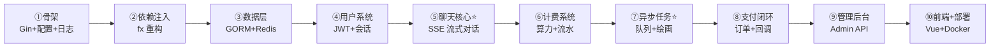

# GeekAI 复现路线图

> 目标：从零复现 GeekAI 后端（Go）+ 简化版前端，吃透它的每一个核心模式。
> 原则：**纵向切片，每阶段产出可运行、可验证的成果**，而不是先把所有表建完、所有层铺完。
> 前置要求：Go 基础语法、SQL 基础、会用 Docker。前端阶段需要 Vue 基础。
> 参考源码：`geekai/api/`（下文所有"参考"均指向原仓库文件）。

---

## 总览：十个阶段

两个 ⭐ 是本项目最有含金量的部分：**SSE 流式转发**（阶段⑤）和**Redis 队列异步任务**（阶段⑦）。其他阶段都是常规 CRUD 和工程化，前四个阶段是为它们打地基。

| 阶段 | 内容 | 预估（业余时间） |
|------|------|------|
| ① | 项目骨架：Gin + TOML 配置 + 日志 | 1 天 |
| ② | uber-go/fx 依赖注入重构 | 1 天 |
| ③ | 数据层：GORM + MySQL + Redis | 1~2 天 |
| ④ | 用户系统：注册/登录/JWT 鉴权 | 2~3 天 |
| ⑤ | 聊天核心：SSE 流式对话 ⭐ | 4~5 天 |
| ⑥ | 算力计费系统 | 1~2 天 |
| ⑦ | 异步任务：队列 + 一个绘画服务 ⭐ | 3~4 天 |
| ⑧ | 支付闭环 | 2~3 天 |
| ⑨ | 管理后台 API | 2~3 天 |
| ⑩ | 前端对接 + Docker 部署 | 3~5 天 |

---

## 阶段①：项目骨架 —— 先让服务跑起来

**目标**：一个能读配置、有日志、能响应 HTTP 的最小 Gin 服务。**先不用 fx**，体会"没有依赖注入时参数怎么传"，阶段②重构时才能理解 fx 解决了什么问题。

**做什么：**
1. `go mod init`，引入 `gin`、`BurntSushi/toml`、`zap` + `lumberjack`；
2. 定义 `AppConfig` 结构体，从 `config.toml` 加载（监听地址、MySQL DSN、Redis 配置）；
3. 封装 zap 日志单例（控制台 + 文件切割双输出）；
4. 写一个 `GET /api/ping` 接口，封装统一响应结构 `BizVo{Code, Message, Data}` 和 `resp.SUCCESS / resp.ERROR` 辅助函数；
5. 加两个全局中间件：panic 恢复（recover 后返回 JSON 而不是断连）、请求参数 TrimSpace 清洗。

**参考**：`api/core/config.go`、`api/core/types/config.go`、`api/logger/`、`api/utils/resp/`、`api/core/app_server.go` 的 `errorHandler`、`api/core/middleware/parameter.go`

**验收**：`curl localhost:5678/api/ping` 返回 `{"code":0,"data":"pong"}`；改 toml 里的端口生效；手动 panic 一个接口，服务不挂。

---

## 阶段②：用 fx 重构 —— 理解依赖注入

**目标**：把阶段①手工 new 出来的对象全部交给 fx 容器管理。这一步代码量小，但决定了之后每个阶段"加新东西"的姿势。

**做什么：**
1. 引入 `go.uber.org/fx`，把 Config、Logger、AppServer 改成 `fx.Provide` 注册的构造函数；
2. 理解两个核心概念：`fx.Provide`（注册"怎么造"，按构造函数参数类型自动解析依赖图）和 `fx.Invoke`（容器启动时立即执行，做路由注册等副作用）；
3. 建立 Handler 规范：每个 Handler 一个结构体 + `NewXxxHandler` 构造函数 + `RegisterRoutes()` 方法，路由注册放在 `fx.Invoke` 里；
4. 加优雅退出：监听 SIGINT/SIGTERM，超时 5 秒关闭。

**参考**：`api/main.go`（整个文件就是 fx 的教科书）、`api/handler/base_handler.go`

**验收**：服务功能与阶段①一致，但 main.go 里看不到一个手工 `New` 调用链；新增一个 handler 只需 Provide + Invoke 两行。

**学习要点**：fx 的报错信息怎么读（缺依赖时它会打印完整依赖图）；为什么大项目需要 DI。

---

## 阶段③：数据层 —— GORM + MySQL + Redis

**目标**：打通三个存储，建立 model/vo 分离的规范。

**做什么：**
1. `fx.Provide` 注册 `*gorm.DB`（连接池参数：MaxIdle 32 / MaxOpen 512）、`*redis.Client`；GORM 配置表前缀 `geekai_`；
2. 定义第一批模型：`User`、`Config`（k-v 配置表）；理解 GORM 的约定（`Id`、`CreatedAt` 等）；
3. 实现**双层配置**：`AppConfig`（toml，基础设施）+ `SystemConfig`（存 DB configs 表的 JSON，运营配置），启动时从 DB 加载缓存到内存；
4. 建立 `model`（数据库实体）/ `vo`（接口返回对象）两个包，写一个 `utils.CopyObject` 反射拷贝工具；
5. 写个简单的迁移机制（GORM AutoMigrate 或像原项目一样手动维护 SQL）。

**参考**：`api/store/mysql.go`、`api/store/redis.go`、`api/store/model/user.go`、`api/store/vo/`、`api/core/config.go` 的 `LoadSystemConfig`

**验收**：启动时自动建表；写一个 `GET /api/config/get?key=system` 能读出 DB 配置。

**踩坑提示**：MySQL DSN 记得带 `parseTime=True&loc=Local`，否则时间字段全错。

---

## 阶段④：用户系统 —— 注册/登录/JWT+Redis 双重鉴权

**目标**：完整的认证闭环，这是后面所有接口的门禁。

**做什么（按依赖顺序）：**
1. 注册接口：密码加盐哈希（参考 `utils.GenPassword`）、用户名查重；
2. 登录接口：密码比对 → 签发 JWT（HMAC，payload 放 `user_id` + `expired`）→ **写 Redis 会话键 `users/{id}`**；
3. `UserAuthMiddleware`：解析 JWT → 校验过期 → **检查 Redis 键存在**（这是"登出立即失效"的关键）→ `c.Set("user_id")`；
4. 登出接口 = 删 Redis 键；个人资料接口 = 从 context 取 user_id 查库；
5. 验证码先做个最简版（生成随机数存 Redis，5 分钟过期），短信/邮件发送留接口（mock 实现），不接真实服务商。

**参考**：`api/core/middleware/auth.go`、`api/handler/user_handler.go` 的 `Login/Register/Logout`、`api/service/captcha_service.go`

**验收**：不带 token 访问受保护接口返回 401；登录后能访问；登出后同一个 token 立即失效（这条最能检验你是否真做对了）。

**学习要点**：为什么 JWT 还要配 Redis？（纯 JWT 无法主动吊销；Redis 会话给了服务端控制权，代价是每次请求多一次 Redis 查询。）

---

## 阶段⑤：聊天核心 —— SSE 流式对话 ⭐ 全项目精华

**目标**：实现"前端发问题 → 后端流式转发大模型 → 打字机输出 → 存历史"的完整链路。**建议拆成 5 个小步，每步都可单独验证：**

**5.1 模型与 Key 管理（地基）**
- 建 `ChatModel`（模型表：value/power/max_tokens/max_context）、`ApiKey`（key 池：type/value/api_url/last_used_at）、`ChatApp`（角色表：name/context 预设上下文）三张表，写简单 CRUD；
- 实现 Key 轮换策略：按 `last_used_at ASC` 取最久未用的，用完更新时间戳。
- 参考：`api/store/model/chat_model.go`、`api/handler/chat_handler.go` 的 `doRequest`

**5.2 最小流式转发（核心中的核心，先脱离业务跑通）**
- 写一个独立接口：手写 `net/http` POST 到任一 OpenAI 兼容 API（`stream:true`），用 `bufio.Scanner` 逐行读响应，解析 `data: {...}` 的 delta，用 `c.SSEvent()` + `Flush()` 转发给客户端；
- 用 `curl -N` 验证能看到逐字输出。
- 参考：`api/handler/chat_openai_handler.go` 的 `sendOpenAiMessage`（重点读它的 Scanner 循环）

**5.3 接入业务校验与上下文**
- 套上鉴权和校验链：用户状态 → 算力余额（先只查不扣）→ token 长度（接入 `tiktoken-go`）；
- 上下文组装：角色预设 context + 最近 N 条历史消息，**带 token 预算裁剪**（响应预留 + 工具 + prompt + 上下文 ≤ max_context）；
- 对话结束保存 `ChatMessage`（问/答两条）+ 首次对话自动建 `ChatItem` 会话（截断标题）。
- 参考：`chat_handler.go` 的 `sendMessage`（L189-390）、`saveChatHistory`

**5.4 停止生成与并发控制**
- 每个请求创建 `context.WithCancel`，CancelFunc 存进并发安全 Map（自己实现一个泛型 LMap）；`GET /api/chat/stop` 取出来调用，掐断上游 HTTP 请求；
- 用户级并发锁：同一用户同时只允许一个对话（TryLock 模式）。
- 参考：`api/core/types/locked_map.go`、`api/core/types/user_lock.go`、`StopGenerate`

**5.5 进阶（可选，可放最后）**
- 工具调用：解析流中的 `tool_calls` delta，拼装参数后 HTTP 回调插件接口，结果推给前端；
- `reasoning_content` 思考过程包 `<think>` 标签；多模态（图片走 vision 消息格式）；文档附件用 Tika 提取文本拼 prompt。
- 参考：`sendOpenAiMessage` 的 toolCall 分支、`function_handler.go`

**验收**：网页/curl 能流式聊天，能停止生成，刷新后历史还在，多轮对话有上下文记忆。

---

## 阶段⑥：算力计费系统

**目标**：把"免费聊天"变成"按模型扣费"，建立资金安全的基本意识。

**做什么：**
1. `User` 表加 `power` 字段，建 `PowerLog` 流水表（类型/数量/余额快照/备注）；
2. `UserService` 提供唯一入口 `IncreasePower / DecreasePower`：**互斥锁 + DB 事务**，余额不足回滚，每笔必写流水；
3. 接入点：注册赠送、对话完成后扣费（阶段⑤的 TODO 补上）、邀请奖励；
4. 用户端加算力流水查询接口。

**参考**：`api/service/user_service.go`（90 行，全文精读）、`api/store/model/power_log.go`

**验收**：并发发 10 个请求扣费，余额和流水对得上账（写个并发测试）；余额不足时对话被拒绝。

**思考题**：原项目用进程内 `sync.Mutex` 防并发，多实例部署时会有什么问题？怎么改？（行锁 `SELECT FOR UPDATE` / 乐观锁 / Redis 分布式锁）

---

## 阶段⑦：异步任务 —— Redis 队列 + 绘画服务 ⭐ 第二个精华

**目标**：实现"提交任务立即返回 → 后台慢慢画 → 前端轮询进度"的模式。**只做一个服务**（推荐 DALL-E 或任一文生图 API，比 MJ 代理好接），做完你就掌握了 MJ/SD/Suno/Video 共用的全部套路。

**做什么（按依赖顺序）：**
1. 封装 `RedisQueue`：Redis List + `RPush` / 阻塞 `BLPop`，30 行（照着 `api/store/redis_queue.go` 写一遍）；
2. 建 Job 表（prompt/progress/img_url/err_msg/task_info）；
3. Handler：校验算力 → 创建 Job(progress=0) → 任务 RPush 入队 → **立即返回 jobId**；
4. Service 启动 3 个 goroutine（由 `fx.Invoke` 拉起）：
   - **消费者**：死循环 BLPop → 调绘画 API → 回写 task_id；
   - **进度同步**：轮询未完成 Job → 查第三方进度 → 更新 DB，超时 10 分钟标失败；
   - **结果转存**：下载生成的图片存本地/OSS，更新 img_url；
5. 重启恢复：`Run()` 启动时把 DB 里未提交的任务重新入队；
6. 失败退算力：任务失败时调用 `IncreasePower` 退款（阶段⑥的成果复用）；
7. OSS 上传器：先实现 Local 本地存储，定义 `Uploader` 接口，留出 MinIO/七牛/阿里的扩展位（理解 Manager 选择器模式）。

**参考**：`api/service/mj/service.go`（消费者模板）、`api/handler/dalle_handler.go`、`api/service/oss/uploader_manager.go`

**验收**：提交绘画秒回；轮询接口能看到进度变化；杀掉进程重启，排队中的任务不丢；画失败自动退算力。

---

## 阶段⑧：支付闭环

**目标**：套餐 → 下单 → 支付 → 回调发货。**用支付宝沙箱环境**（免费，不需要真实商户）。

**做什么：**
1. 建 `Product`（套餐：价格/算力数量）、`Order`（订单号/状态/金额）表 + CRUD；
2. 下单接口：生成订单号（学一下原项目的雪花算法 `snowflake.go`）→ 调 `gopay` 生成支付链接/二维码；
3. **回调接口**（难点）：验签 → 幂等检查（已处理的订单直接返回）→ 更新订单状态 → `IncreasePower` 发货；
4. 兜底：定时轮询未支付订单主动查单（参考 `StartSyncOrders`），处理回调丢失的情况；
5. 金额计算全程用 `shopspring/decimal`，不要用 float。

**参考**:`api/handler/payment_handler.go`、`api/service/payment/alipay_service.go`、`api/service/snowflake.go`

**验收**：沙箱完成一笔支付，算力到账且流水正确；重放回调请求不会重复发货（幂等测试）。

**学习要点**：支付回调是公网异步打进来的，验签防伪造 + 幂等防重放，是所有支付系统的两条铁律。

---

## 阶段⑨：管理后台 API

**目标**：体会"同一套数据，两套权限体系"。这阶段技术新东西少，是巩固期。

**做什么：**
1. `AdminUser` 表 + 独立的 `AdminAuthMiddleware`（不同的请求头、不同的 Redis 键前缀 `admin/{id}`）；
2. 按需做几组管理接口：用户管理（封禁/调算力）、模型管理、ApiKey 管理、订单列表、仪表盘统计（练 GORM 聚合查询）；
3. 体验一下"运营配置"闭环：管理后台改 `SystemConfig` → 写回 DB → 刷新内存缓存 → 用户端行为变化。

**参考**：`api/handler/admin/` 整个目录，挑 3-4 个 handler 读

**验收**：管理员登录后台调整某模型的 power 价格，用户端下次对话扣费随之变化。

---

## 阶段⑩：前端对接 + Docker 部署

**前端二选一：**
- **路线 A（推荐，省时）**：直接拿原项目 `web/` 对接你的后端——把你的接口路径、字段对齐原项目，这本身就是很好的"按接口契约开发"训练；
- **路线 B（练前端）**：自己写简化版 Vue3 应用，只做登录页 + 聊天页 + 绘画页。聊天打字机用 `@microsoft/fetch-event-source` 消费 SSE。

**部署：**
1. 写后端 `Dockerfile`（多阶段构建：golang 镜像编译 → alpine 运行）；
2. 写 `docker-compose.yaml`：mysql + redis + api + web(nginx)，配 healthcheck 和启动依赖；
3. Nginx 配置：静态资源 + `/api` 反代，**注意 SSE 需要 `proxy_buffering off`**，WebSocket 需要 Upgrade 头；
4. 参考原项目 `docker/docker-compose.yaml` 和 `docker/conf/nginx/`。

**验收**：一台干净机器上 `docker-compose up -d` 后全功能可用。

---

## 复现时的简化建议（哪些可以砍）

| 可以砍/Mock | 理由 |
|------|------|
| 微信登录、真实短信 | 依赖外部商户资质，用 mock 验证码即可 |
| MJ/SD/Suno/Video/即梦 全家桶 | 模式完全一样，做一个就够，其余是体力活 |
| 内容审核三个厂商 | 定义好接口，写一个总是通过的 mock 实现 |
| License 服务、安装统计 | 与学习目标无关 |
| 桌面客户端、移动端适配 | 范围控制 |
| LevelDB | 项目里用得很少，可后补 |

## 每个阶段通用的学习方法

1. **先读原码再动手**：动手前把"参考"列的文件读懂（可以回来问我，我可以用调用图帮你展开任何一条链路）；
2. **不抄、凭理解写**：写完再和原码对比，差异处往往就是你没理解到位的地方；
3. **每阶段留一个"思考题"写进笔记**：比如阶段⑥的分布式锁问题、阶段⑧的幂等问题——这些是面试和实战的分水岭；
4. **git 打 tag**：每完成一个阶段打一个 tag，方便回溯。
