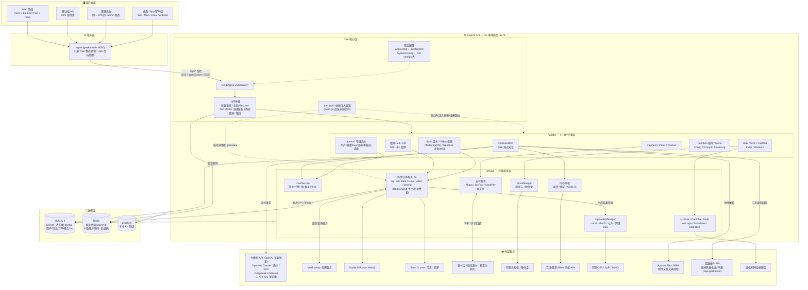
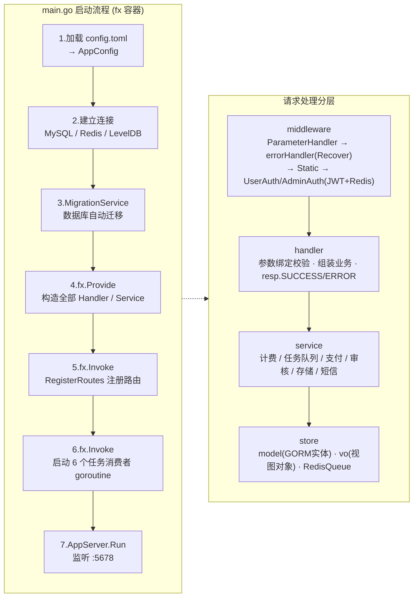
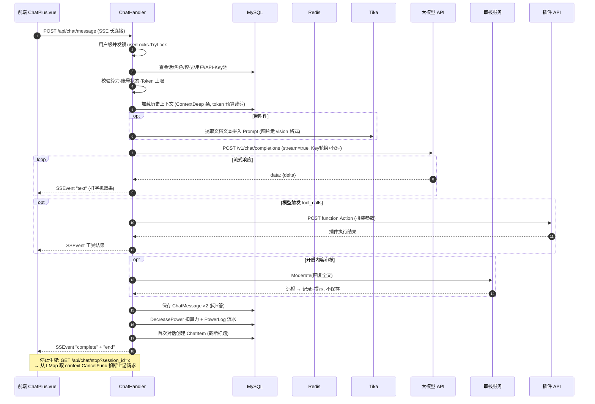
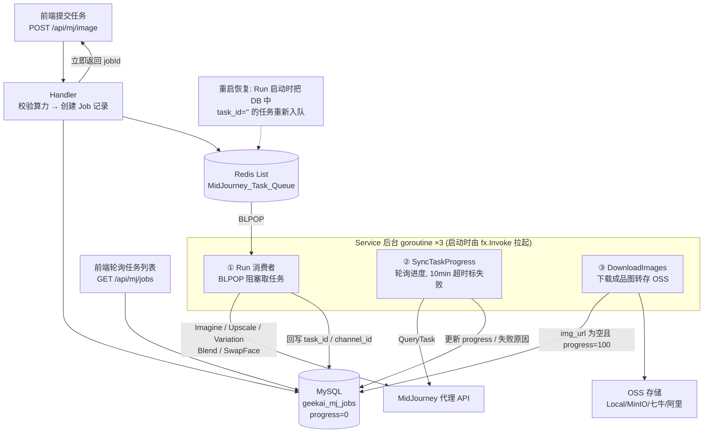
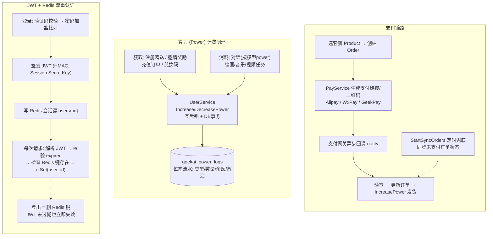
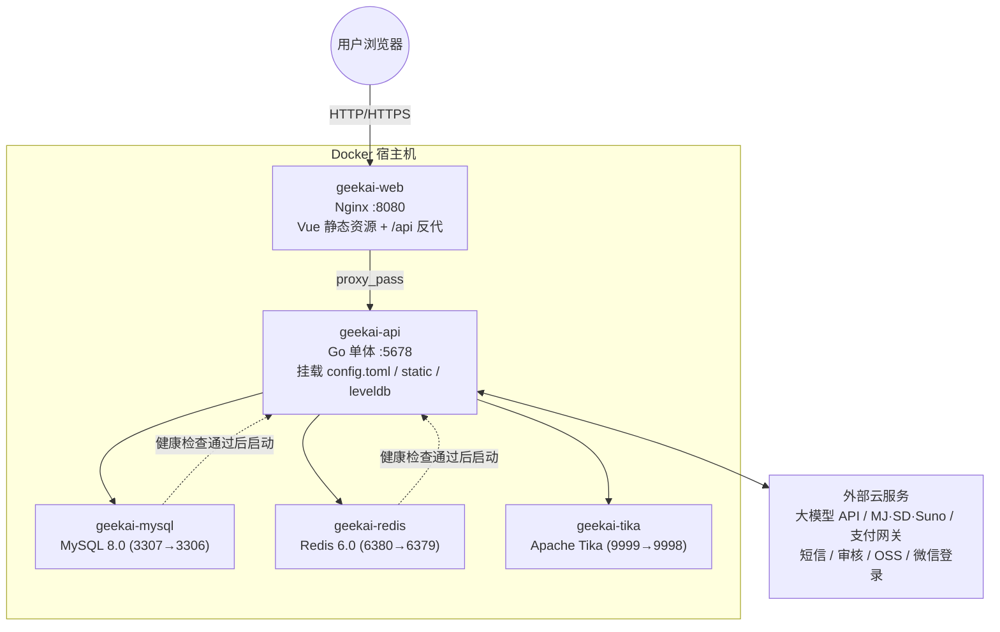

# GeekAI 系统完整架构图

> 基于 geekai v4.2.7 源码梳理（后端 Go + 前端 Vue3，单体应用 + Docker 部署）。
> 所有图均为 Mermaid，可在 GitHub / VS Code / Typora 中直接渲染。

---

## 1. 总体系统架构图

---

## 2. 后端内部分层与启动流程

---

## 3. 核心链路①：SSE 流式聊天时序图

---

## 4. 核心链路②：异步 AI 任务（MJ/SD/DALL-E/Suno/视频/即梦 通用模式）

---

## 5. 认证与计费体系

---

## 6. 部署拓扑图（docker-compose）

---

## 7. 目录 ↔ 架构对照表

| 架构层 | 目录 | 关键文件 |
|--------|------|----------|
| 启动/组装 | `api/main.go` | fx 容器：Provide 依赖 + Invoke 路由/消费者 |
| 核心 | `api/core/` | `app_server.go`(Gin封装) · `config.go` · `middleware/auth.go` |
| HTTP 层 | `api/handler/` | `chat_handler.go`+`chat_openai_handler.go`(SSE对话核心) · `admin/`(后台) |
| 业务层 | `api/service/` | `user_service.go`(计费) · `mj/ sd/ dalle/ suno/ video/ jimeng/`(异步任务) · `payment/ sms/ moderation/ oss/` |
| 数据层 | `api/store/` | `mysql.go` · `redis_queue.go` · `model/`(25+实体) · `vo/`(视图对象) |
| 前端 | `web/src/` | `views/`(页面) · `store/`(Pinia) · `components/` |
| 部署 | `docker/` | `docker-compose.yaml` · `conf/nginx/` |
