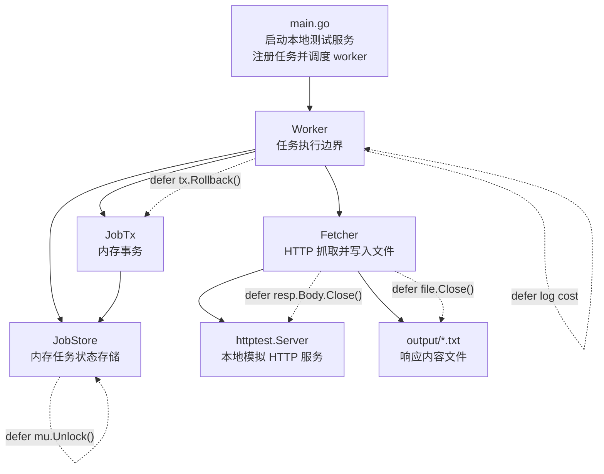
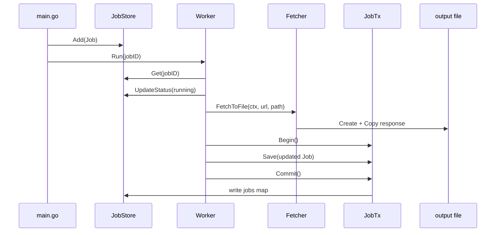
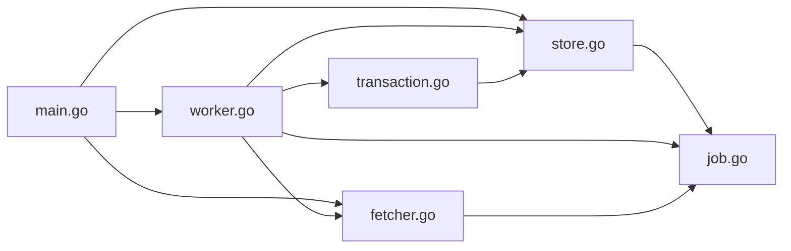

# FetchJob Runner


FetchJob Runner 是一个用于学习 Go 工程化异常处理与资源生命周期管理的后台任务执行示例项目。项目通过一个最小可运行的任务抓取流程，集中演示 `defer` 在 HTTP 连接释放、文件关闭、互斥锁解锁、事务回滚兜底、context 取消、耗时日志与 panic 恢复中的实际用途。

> 当前版本是教学/演示项目，不是完整生产任务平台。README 中带有 `[填写：...]` 的内容是后续生产化落地时需要人工补充的业务信息。

<details>
<summary>快速开始</summary>

```powershell
cd D:\AAAJove\golang\fetchjob-runner
go run .
```

预期输出包含 4 个任务状态：

```text
job=1 status=success
job=2 status=failed error="unexpected status code: 500"
job=3 status=failed error="... context deadline exceeded"
job=4 status=failed error="panic: manual panic for testing recover"
```

成功任务会写入：

```text
output/job-1.txt
```

</details>

---

## 一、战略层（为什么做这个项目） ⭐⭐⭐

### 项目背景

FetchJob Runner 解决的核心问题是：用一个小而完整的 Go 项目展示工程代码中如何可靠释放资源、处理失败路径并防止任务 panic 影响主流程。

### 业务目标

面向对象：

- Go 初学者：理解 `defer` 不只是语法，而是资源生命周期管理工具。
- 协作者开发者：通过小项目掌握任务执行、状态更新、错误传播和 panic 边界设计。
- 技术管理者/架构评审者：快速判断该示例能否扩展为真实后台任务执行器。

创造价值：

- 提供可运行、可观察、可扩展的 Go 异常处理学习样例。
- 把 `defer` 的 6 个典型工程场景放入同一个执行链路。
- 为后续引入真实数据库、任务队列、HTTP API、监控和部署提供最小骨架。

成功标准：

- `go run .` 可以稳定运行。
- 成功、HTTP 失败、超时、panic 4 类路径均能被正确记录。
- 所有关键资源都有明确的 `defer` 释放点。

### 核心用户场景

1. 新人学习 Go 异常处理学习者运行项目后，对照日志理解 `defer`、`context`、`error`、`panic/recover` 的协作方式。
2. 团队内部培训讲师通过修改 `worker.go`、`fetcher.go` 和 `transaction.go`，演示资源泄漏、锁泄漏、事务未回滚等问题如何产生。
3. 后台任务系统原型验证
   开发者基于当前内存版 `JobStore` 和 `JobTx`，替换为真实数据库和任务队列，形成生产系统雏形。

### 快速定位

**Go defer 工程实践演示型后台任务执行器。**

---

## 二、架构层（系统长什么样） ⭐⭐⭐

### 总体架构图



### 技术栈全景

| 分类         | 当前选型              | 说明                                              |
| ------------ | --------------------- | ------------------------------------------------- |
| 语言与运行时 | Go 1.26.3             | `go.mod` 当前声明版本                           |
| HTTP 客户端  | `net/http`          | 用 `http.Client` 发起带 context 的请求          |
| 本地测试服务 | `net/http/httptest` | 运行时创建 `/ok`、`/fail`、`/slow` 模拟端点 |
| 文件 I/O     | `os`、`io`        | 将成功响应写入 `output/*.txt`                   |
| 并发控制     | `sync.Mutex`        | 保护内存 map                                      |
| 日志         | 标准库 `log`        | 输出任务耗时、panic 恢复和失败信息                |
| 事务         | 自定义 `JobTx`      | 内存模拟事务，用于演示 `defer Rollback()`       |
| 部署依赖     | 无                    | 当前为本地 CLI 演示程序                           |

### 部署拓扑

当前拓扑：

```text
Developer Machine
└── go run .
    ├── in-process httptest server
    ├── in-memory JobStore
    └── local output directory
```

最低运行要求：

- Go 1.22+ 理论可运行；当前项目声明 `go 1.26.3`。
- 本地文件系统可写，程序会创建 `output/`。
- 不依赖外网，不依赖数据库，不依赖 Docker。

推荐开发配置：

- Go 与 `gofmt` 可用。
- 编辑器开启 Go 语言服务。
- 后续生产化建议加入 Docker、CI、真实数据库与可观测性组件。

---

## 三、数据层（数据怎么组织） ⭐⭐⭐

### 核心实体

#### `Job`

定义位置：`job.go`

| 字段       | 类型          | 说明                                             |
| ---------- | ------------- | ------------------------------------------------ |
| `ID`     | `int`       | 任务唯一标识                                     |
| `URL`    | `string`    | 抓取目标；特殊值 `"panic"` 用于测试 panic 恢复 |
| `Path`   | `string`    | 响应内容写入路径                                 |
| `Status` | `JobStatus` | 当前任务状态                                     |
| `Error`  | `string`    | 失败原因                                         |

#### `JobStatus`

定义位置：`job.go`

```text
pending  -> running -> success
                   \-> failed
```

#### `JobStore`

定义位置：`store.go`

| 字段     | 类型            | 说明         |
| -------- | --------------- | ------------ |
| `mu`   | `sync.Mutex`  | 保护任务 map |
| `jobs` | `map[int]Job` | 内存任务表   |

#### `JobTx`

定义位置：`transaction.go`

| 字段           | 类型            | 说明                   |
| -------------- | --------------- | ---------------------- |
| `store`      | `*JobStore`   | 事务最终提交的目标存储 |
| `pending`    | `map[int]Job` | 事务内暂存的任务变更   |
| `committed`  | `bool`        | 是否已提交             |
| `rolledBack` | `bool`        | 是否已回滚             |

### 数据关系

- `JobStore` 与 `Job` 是 1:N 关系。
- `Worker` 通过 `JobStore.Get(jobID)` 读取一个任务。
- `Worker` 通过 `JobTx.Save(job)` 暂存任务最终状态。
- `JobTx.Commit()` 将 `pending` 数据写回 `JobStore.jobs`。

### 数据流转



---

## 四、接口层（怎么与系统交互） ⭐⭐

### 外部 API 概览

当前项目没有对外暴露 HTTP API。它是一个 CLI 运行的本地演示程序。

内部测试 HTTP 服务由 `httptest.NewServer` 创建，包含：

| 路径      | 行为                | 用途                  |
| --------- | ------------------- | --------------------- |
| `/ok`   | 返回 200 和文本内容 | 验证成功路径          |
| `/fail` | 返回 500            | 验证 HTTP 失败路径    |
| `/slow` | 延迟 2 秒返回       | 验证 context 超时路径 |

生产化预留：

- `[填写：任务创建 API，如 POST /jobs]`
- `[填写：任务查询 API，如 GET /jobs/{id}]`
- `[填写：任务列表 API，如 GET /jobs]`
- `[填写：任务取消 API，如 POST /jobs/{id}/cancel]`

### 认证方式

当前版本无认证鉴权。

生产化建议：

- 内部系统：API Key 或 mTLS。
- 面向用户：JWT / OAuth2。
- 管理接口：RBAC 权限控制。

### 事件/消息

当前版本没有消息队列。

生产化建议事件：

| 事件              | 触发时机                |
| ----------------- | ----------------------- |
| `job.created`   | 任务创建                |
| `job.started`   | worker 开始执行         |
| `job.succeeded` | 抓取成功且结果提交      |
| `job.failed`    | HTTP 失败、超时或 panic |
| `job.timeout`   | context 超时            |

---

## 五、代码层（怎么读懂代码） ⭐⭐⭐

### 目录结构

```text
fetchjob-runner/
├── go.mod              # Go 模块定义
├── main.go             # 程序入口；创建测试服务、任务和 worker
├── job.go              # Job 与 JobStatus 数据模型
├── store.go            # 线程安全的内存任务存储
├── transaction.go      # 内存事务模拟；演示 defer Rollback
├── fetcher.go          # HTTP 抓取和文件写入
├── worker.go           # 核心任务执行流程；集中演示 defer
├── Readme.md           # 项目文档
└── output/             # 运行时生成；成功任务输出文件
```

### 核心模块依赖



### 关键执行流程

#### 流程 1：成功任务

入口：`main.go -> worker.Run(job.ID)`

1. `main.go` 创建 `/ok` 测试服务和 `Job{Status: pending}`。
2. `store.Add(job)` 将任务写入内存。
3. `worker.Run(jobID)` 注册 panic 恢复、耗时日志、context 取消。
4. `store.UpdateStatus(..., running, "")` 标记任务运行中。
5. `fetcher.FetchToFile(...)` 发起 HTTP 请求并写入文件。
6. `tx := store.Begin()` 开启事务。
7. `defer tx.Rollback()` 注册兜底回滚。
8. `tx.Save(job)` 暂存成功状态。
9. `tx.Commit()` 提交到 `JobStore`。

#### 流程 2：panic 任务

入口：`worker.Run(jobID)`

1. 任务 URL 为 `"panic"`。
2. `worker.Run` 主流程触发 `panic("manual panic for testing recover")`。
3. 已注册的 defer 逆序执行。
4. 耗时日志先输出。
5. recover defer 捕获 panic。
6. `store.UpdateStatus(jobID, failed, "panic: ...")` 标记失败。
7. 进程继续运行，不被单个任务打断。

### defer 使用点索引

| 场景           | 文件                             | 代码意图                                      |
| -------------- | -------------------------------- | --------------------------------------------- |
| HTTP body 关闭 | `fetcher.go`                   | `defer resp.Body.Close()` 释放连接资源      |
| 文件关闭       | `fetcher.go`                   | `defer file.Close()` 释放文件句柄           |
| mutex 解锁     | `store.go`、`transaction.go` | `defer mu.Unlock()` 防止错误路径忘记解锁    |
| 事务回滚兜底   | `worker.go`                    | `defer tx.Rollback()` 确保未提交事务被清理  |
| context 取消   | `worker.go`                    | `defer cancel()` 释放 timer 等资源          |
| 耗时日志       | `worker.go`                    | `defer func(){ log... }()` 覆盖所有退出路径 |
| panic 恢复     | `worker.go`                    | `defer recover()` 将 panic 转为失败状态     |
| 测试服务关闭   | `main.go`                      | `defer server.Close()` 释放本地服务         |

---

## 六、运行层（怎么观测系统） ⭐⭐

### 日志规范

当前日志使用标准库 `log`，格式由 `main.go` 设置：

```go
log.SetFlags(log.LstdFlags | log.Lmicroseconds)
```

当前日志类型：

| 日志                                   | 来源          | 用途             |
| -------------------------------------- | ------------- | ---------------- |
| `job <id> finished, cost = ...`      | `worker.go` | 观测任务耗时     |
| `job <id> recovered from panic: ...` | `worker.go` | 观测 panic 兜底  |
| `job <id> save failed: ...`          | `worker.go` | 观测事务保存失败 |
| `job <id> commit failed: ...`        | `worker.go` | 观测事务提交失败 |

生产化建议：

- 使用结构化日志，如 `slog`、`zap` 或 `zerolog`。
- 为每个任务输出 `job_id`、`status`、`duration_ms`、`error`。
- 日志写入 stdout，由容器平台或日志 Agent 采集。

### 监控指标

当前版本未暴露 Metrics。

生产化建议指标：

| 指标                           | 类型      | 说明                    |
| ------------------------------ | --------- | ----------------------- |
| `fetchjob_total`             | Counter   | 任务总数，按状态分组    |
| `fetchjob_duration_seconds`  | Histogram | 任务耗时                |
| `fetchjob_panic_total`       | Counter   | recover 捕获的 panic 数 |
| `fetchjob_timeout_total`     | Counter   | context 超时数          |
| `fetchjob_http_status_total` | Counter   | HTTP 响应状态码分布     |

### 健康检查

当前版本无健康检查端点。

生产化建议：

- `GET /healthz`：进程存活。
- `GET /readyz`：依赖可用，如数据库、队列、对象存储。
- `GET /metrics`：Prometheus 指标。

---

## 七、安全层（怎么保障安全） ⭐

### 权限模型

当前版本无权限模型。

生产化建议：

- 普通用户：创建和查看自己的任务。
- 运维用户：查看全局任务、重试失败任务。
- 管理员：配置 worker、超时、并发和目标白名单。

### 认证鉴权

当前版本无登录流程和 Token 机制。

生产化建议：

- 内部服务间调用使用 API Key 或 mTLS。
- 外部用户使用 OAuth2 / JWT。
- 管理接口增加 RBAC。

### 敏感数据处理

当前版本不会处理密钥、用户隐私或生产数据。

生产化注意事项：

- URL、错误信息和响应内容可能包含敏感数据，日志需要脱敏。
- 输出文件建议写入受控目录，防止路径穿越。
- HTTP 抓取应加入目标域名白名单，降低 SSRF 风险。

---

## 八、质量层（怎么保证质量） ⭐⭐⭐

### 测试策略

当前版本尚未包含自动化测试。建议补充：

| 测试类型 | 建议文件                | 覆盖目标                                     |
| -------- | ----------------------- | -------------------------------------------- |
| 单元测试 | `store_test.go`       | `Add`、`Get`、`List`、`UpdateStatus` |
| 单元测试 | `transaction_test.go` | `Save`、`Commit`、`Rollback` 状态机    |
| 集成测试 | `worker_test.go`      | 成功、500、超时、panic 4 条路径              |
| 集成测试 | `fetcher_test.go`     | HTTP body 关闭、文件写入、非 2xx 错误        |

推荐运行方式：

```powershell
go test ./...
```

### 核心不变量

这些规则不应被破坏：

- 任意任务最终只能处于 `success` 或 `failed`，运行中状态不能永久残留。
- `JobStore.jobs` 的读写必须受 `mu` 保护。
- `JobTx.Commit()` 成功后，后续 `Rollback()` 不能撤销已提交数据。
- `Fetcher` 遇到非 2xx 状态码时必须返回错误。
- worker 内部 panic 必须被 recover，并转换为任务失败状态。
- context 超时必须能中断 HTTP 请求。

### 代码质量

当前建议：

```powershell
gofmt -w .
go test ./...
go vet ./...
```

生产化建议：

- 引入 `golangci-lint`。
- 建立 CI，至少执行 `gofmt`、`go test`、`go vet`。
- 覆盖率门槛建议从 70% 起步，核心状态机和 worker 流程应更高。

---

## 九、演进层（项目的历史与未来） ⭐⭐

### 已知问题 / TODO

当前限制：

- `JobStore` 是内存存储，进程退出数据丢失。
- `JobTx` 是教学用事务模拟，不是真实数据库事务。
- worker 当前串行执行任务，没有 worker pool。
- 没有对外 API、认证、监控和健康检查。
- 没有自动化测试。
- `store.List()` 返回 map 遍历结果，输出顺序不稳定。
- `Fetcher` 没有限制响应体大小，生产环境可能导致磁盘风险。
- 输出路径由任务传入，生产环境需要路径校验。

### 变更影响提示

修改高频模块时需要注意：

- 修改 `JobStatus`：同步更新状态流转、测试断言和 README。
- 修改 `JobStore`：确保所有 map 访问仍在锁保护下。
- 修改 `JobTx`：不要破坏 `Commit()` 后 `Rollback()` 无副作用这一语义。
- 修改 `Worker.Run`：确认 defer 注册顺序符合预期，尤其是 recover 与耗时日志。
- 修改 `Fetcher`：确保 HTTP body 和文件句柄仍被关闭。

### 路线图

短期：

- 增加 `*_test.go`。
- 对 `store.List()` 输出排序。
- 将日志改为结构化日志。

中期：

- 引入真实数据库，如 SQLite/PostgreSQL。
- 增加 HTTP API。
- 增加 worker pool 和任务队列。

长期：

- 容器化部署。
- Prometheus Metrics 和健康检查。
- 支持任务重试、取消、限流和目标白名单。

---

## 十、协作层（怎么参与项目） ⭐⭐

### 代码所有权

当前未配置 `CODEOWNERS`。

建议：

```text
*                @[填写：项目负责人]
/worker.go       @[填写：任务执行模块负责人]
/fetcher.go      @[填写：网络与 I/O 模块负责人]
/transaction.go  @[填写：存储模块负责人]
```

### 贡献指南

建议流程：

1. 创建 Issue，说明问题、复现方式或改进目标。
2. 从主分支创建特性分支。
3. 提交前运行：

   ```powershell
   gofmt -w .
   go test ./...
   go vet ./...
   ```
4. PR 描述需要包含：

   - 变更内容
   - 验证方式
   - 是否影响任务状态流转
   - 是否影响 defer / recover / context 行为

代码规范：

- 错误返回使用 `fmt.Errorf("context: %w", err)` 包装。
- 获取资源后尽快注册对应 `defer`。
- 不要在没有锁的情况下访问 `JobStore.jobs`。
- 新增失败路径时必须考虑任务最终状态。

### 沟通渠道

当前未配置正式沟通渠道。

预留：

- Wiki：`[填写：项目 Wiki 地址]`
- IM 群：`[填写：Slack / 钉钉 / 飞书群]`
- 架构文档：`[填写：技术文档入口]`
- Issue Tracker：`[填写：GitHub / GitLab / Jira 地址]`

---

## 附录：运行结果解读

运行：

```powershell
go run .
```

典型结果：

```text
job=1 status=success error="" path=output/job-1.txt
job=2 status=failed error="unexpected status code: 500" path=output/job-2.txt
job=3 status=failed error="do request: Get \".../slow\": context deadline exceeded" path=output/job-3.txt
job=4 status=failed error="panic: manual panic for testing recover" path=output/job-4.txt
```

含义：

- `job=1`：成功路径，验证 HTTP body 关闭、文件关闭、事务提交。
- `job=2`：HTTP 500，验证错误返回和 body 关闭。
- `job=3`：请求超过 1 秒，验证 context 超时和 cancel。
- `job=4`：手动 panic，验证 recover 兜底和任务失败落库。

---

## License

`[填写：许可证，如 MIT / Apache-2.0 / Proprietary]`
